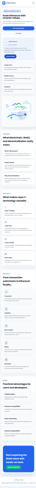
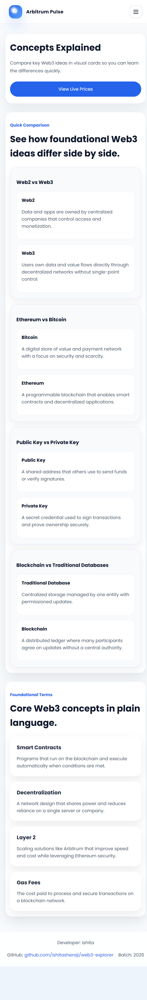
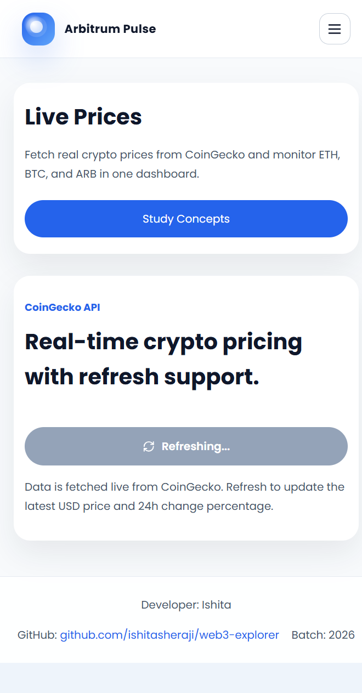
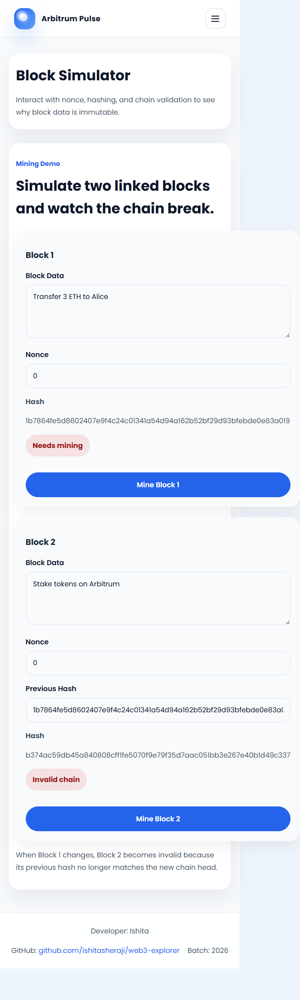

🚀 Arbitrum Pulse

A Modern Web3 Educational Platform Built with React & Vite.

Arbitrum Pulse is a modern, responsive educational website designed to help beginners understand Blockchain, Ethereum, Layer 2 Scaling, and the Arbitrum Ecosystem through interactive visualizations and real-world demonstrations.

The project combines educational content, real-time cryptocurrency prices, and an interactive blockchain mining simulator into one cohesive web application. It demonstrates modern React development practices, responsive UI/UX, API integration, routing, and blockchain fundamentals.

🌟 Project Overview

Arbitrum Pulse was developed as a hands-on learning platform for Web3 enthusiasts and students. Instead of presenting theory alone, the application combines four interconnected pages that explain blockchain concepts through engaging visuals and interactive components.

The project focuses on helping users understand how Ethereum Layer 2 solutions improve scalability while providing practical demonstrations of blockchain concepts such as hashing, proof-of-work, and chain immutability.

✨ Features

🎨 Modern Light UI with Professional Design

📱 Fully Responsive Layout

⚛️ Built using React + Vite

🧭 React Router Navigation

📚 Beginner-Friendly Web3 Learning Platform

💹 Real-Time Cryptocurrency Prices

🔗 Interactive Blockchain Mining Simulator

🔒 SHA-256 Hash Generation

⛏️ Proof-of-Work Demonstration

♻️ Reusable React Components

⚡ Fast Performance

🎯 Clean and Maintainable Code

📄 Website Pages

🏠 Home : 
A  modern landing page introducing the Arbitrum ecosystem.

Includes

Responsive Navigation Bar

Hero Section

About Arbitrum

Why Ethereum Needed Layer 2

Blockchain Illustration

Features Section

Benefits Section

Blockchain Workflow Timeline

Call-to-Action

Responsive Footer

📚 Concepts :
An educational reference page explaining important Web3 concepts using modern comparison cards.

Topics Covered

Web2 vs Web3

Ethereum vs Bitcoin

Public Key vs Private Key

Blockchain vs Traditional Database

Each concept is explained in simple language with visual comparisons for easy understanding.

💹 Live Prices

A cryptocurrency dashboard powered by the CoinGecko API.

Features

Live Ethereum (ETH) Price

Live Bitcoin (BTC) Price

Live Arbitrum (ARB) Price

Current USD Prices

24-Hour Price Change

Green/Red Trend Indicators

Refresh Button

Responsive Cards

⛓️ Block Simulator

An interactive blockchain mining simulator built with JavaScript.

An interactive blockchain mining simulator built with JavaScript.

Demonstrates

SHA-256 Hashing

Nonce-Based Mining

Simulated Proof-of-Work

Previous Hash Linking

Block Validation

Blockchain Immutability

Chain Integrity

Changing the data inside Block 1 immediately invalidates Block 2, visually demonstrating how blockchain immutability works.

🛠️ Technology Stack

Frontend

React

Vite

JavaScript (ES6+)

HTML5

CSS3

Libraries

React Router DOM

Lucide React

APIs

CoinGecko Public API

Browser APIs

Web Crypto API (SHA-256)

📂 Project Structure
arbitrum-pulse/

│

├── public/

├── src/

│   ├── assets/

│   │   ├── images/

│   │   └── icons/

│   │

│   ├── components/

│   │   ├── Navbar.jsx

│   │   ├── Footer.jsx

│   │   ├── FeatureCard.jsx

│   │   ├── ConceptCard.jsx

│   │   ├── PriceCard.jsx

│   │   ├── BlockCard.jsx

│   │   ├── Loader.jsx

│   │   └── Button.jsx

│   │

│   ├── pages/

│   │   ├── Home.jsx

│   │   ├── Concepts.jsx

│   │   ├── LivePrices.jsx

│   │   ├── BlockSimulator.jsx

│   │   └── NotFound.jsx

│   │

│   ├── styles/

│   ├── utils/

│   ├── App.jsx

│   └── main.jsx

│
├── screenshots/

│   ├── home.png

│   ├── concepts.png

│   ├── live-prices.png

│   └── block-simulator.png

│
├── package.json

├── vite.config.js

├── README.md

└── index.html

## Live demo

- https://ishitasheraji.github.io/web3-explorer/

## Screenshots

- `screenshots/home.png`
- `screenshots/concepts.png`
- `screenshots/live-prices.png`
- `screenshots/block-simulator.png`

🚀 Installation & Setup

Clone the repository

git clone https://github.com/ishitasheraji/web3-explorer.git

Navigate to the project folder

cd web3-explorer

Install dependencies

npm install

Start the development server

npm run dev

🌐 Live Demo

GitHub Pages

https://ishitasheraji.github.io/web3-explorer/

🎯 Learning Outcomes

Through this project, users can learn:

Blockchain Fundamentals
Web3 Architecture
Ethereum Layer 2 Scaling
Arbitrum Ecosystem
Cryptocurrency APIs
React Routing
API Integration
Proof-of-Work
SHA-256 Hashing
Blockchain Immutability

Modern Frontend Development
🚀 Future Improvements
🌙 Dark Mode
👛 MetaMask Wallet Integration
📈 Interactive Price Charts
💰 More Cryptocurrency Support
🔍 Transaction Explorer
🖼️ NFT Gallery
📊 Portfolio Tracker
🔔 Price Alerts
⚡ Better Animations
📱 Progressive Web App (PWA)

📄 License

This project was developed for educational purposes as part of a Web3 learning assignment.

🙏 Acknowledgements

Special thanks to:

React Team
Vite Team
CoinGecko API
Arbitrum Foundation
Ethereum Community

  ## 👩‍💻 Author

Ishita Sheraji
GitHub:
https://github.com/ishitasheraji
